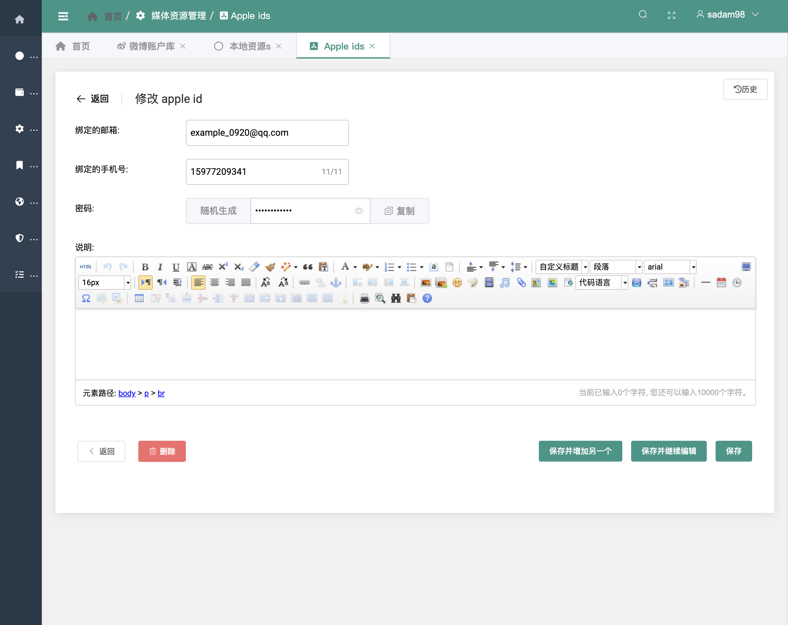
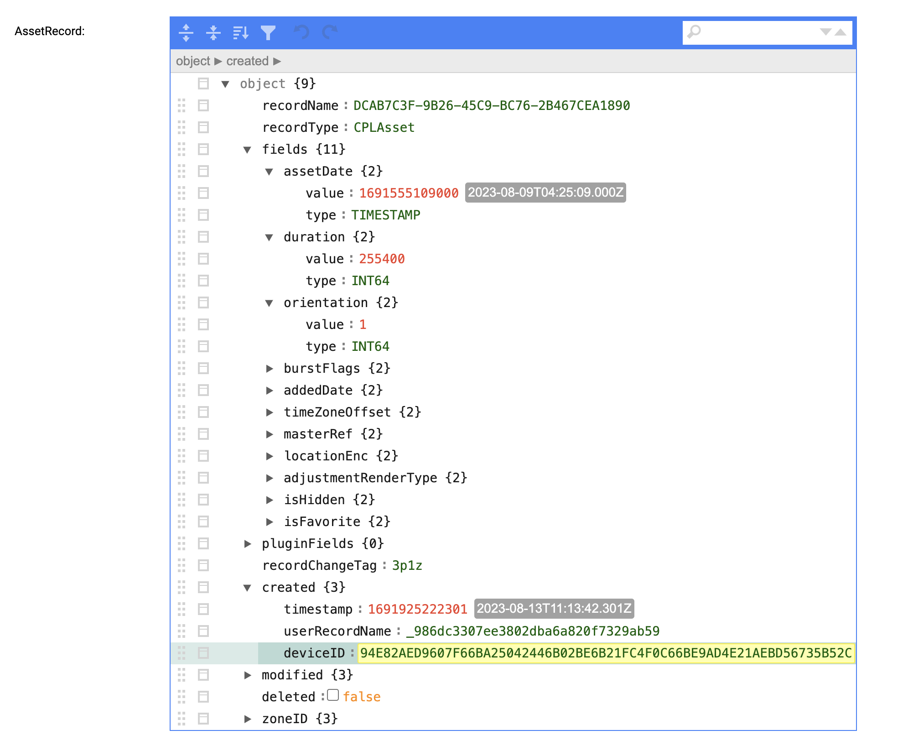
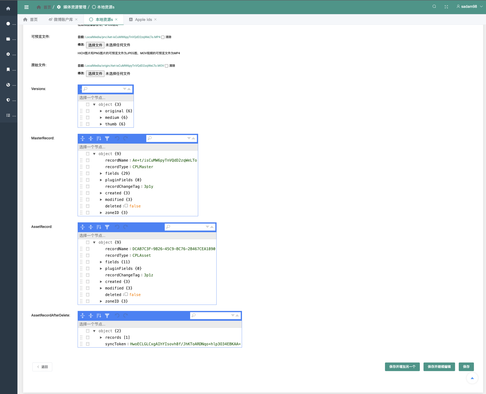

# 组件文档

继承于 [SimplePro组件文档](https://www.mldoo.com/docs/simplepro/widget/checkbox.html#%E5%A4%8D%E9%80%89%E6%A1%86%E7%BB%84%E4%BB%B6)

## 基础组件

## 基础组件

### 密码组件

继承自`models.CharField`表单字段

#### 效果


#### 如何引入

```python
from simplepro.components.fields import PasswordInputField
```

#### 参数

| 参数名             | 类型        | 必须  | 说明                                                      | 可选值                   | 默认值                                                                      |
|-----------------|-----------|-----|---------------------------------------------------------|-----------------------|--------------------------------------------------------------------------|
| max_length      | `number`  | ✅️  | 原生属性，最大输入长度                                             |                       |                                                                          |     |
| min_length      | `number`  | ☑️  | 原生属性，最小输入长度                                             |                       | 6                                                                        |     |
| placeholder     | `string`  | ☑️  | 输入框占位文本                                                 |                       | 
| clearable       | `boolean` | ☑️  | 是否可一键清空                                                 |                       | `True`                                                                   | 
| show_password   | `boolean` | ☑️  | 是否显示`明文显示`和`隐藏密码`两种状态之间切换的按钮                            |                       | `True`                                                                   | 
| show_word_limit | `boolean` | ☑️  | 是否显示输入字数统计，只在 `type = "text"` 或 `type = "textarea"` 时有效 |                       | `False`                                                                  | 
| disabled        | `boolean` | ☑️  | 禁用                                                      |                       | `False`                                                                  | 
| readonly        | `boolean` | ☑️  | 原生属性，是否只读                                               |                       | `False`                                                                  | 
| size            | `string`  | ☑️  | 输入框尺寸，只在 `type!="textarea"` 时有效                         | medium / small / mini |                                                                          | 
| autofocus       | `boolean` | ☑️  | 原生属性，自动获取焦点                                             | true, false           | `False`                                                                  | 
| style           | `string`  | ☑️  | 原生属性，样式                                                 |                       |                                                                          | 
| encrypt         | `string`  | ☑️  | 加密算法                                                    | md5                   | 
| pattern         | `string`  | ☑️  | 随机生成的可选字符集                                              |                       | "abcdefghijklmnopqrstuvwxyzABCDEFGHIJKLMNOPQRSTUVWXYZ0123456789_-$%&@+!" | 

其他参数都继承`forms.CharField`.

#### 示例

```python
import datetime
from django.db import models

from simplepro.components import fields
from simplepro.components.fields import PasswordInputField
from simplepro.models import BaseModel


class AppleId(BaseModel):
    email = fields.CharField(verbose_name="绑定的邮箱", max_length=30, placeholder="请输入电子邮箱", null=True, unique=True,
                             blank=True)
    tel = fields.CharField(verbose_name="绑定的手机号", max_length=11, placeholder="请输入绑定的手机号", null=True, unique=True,
                           blank=True, show_word_limit=True)
    passwd = PasswordInputField(verbose_name='密码', max_length=12, placeholder='请输入密码', null=True, blank=True,
                                show_password=True, show_word_limit=True, pattern="0123456789", encrypt="md5")
    last2FactorAuthenticateAt = models.DateTimeField(verbose_name="上次两步验证时间", null=True, blank=True, editable=False)
    lastConfirmedSessionValidityAt = models.DateTimeField(verbose_name="上次确认会话有效性时间", null=True, blank=True,
                                                          editable=False)
    maxSessionAge = models.DurationField(verbose_name="最长会话有效期", blank=True, editable=False,
                                         default=datetime.timedelta(seconds=0))
```



## 高级组件

### Json编辑器

继承自`models.TextField`表单字段

#### 效果图



#### 如何引入

```python
from simplepro.editor.fields import JsonTextField
```

#### 参数

目前没有专属参数,其他参数都继承`models.TextField`.

#### 示例

```python
from django.db import models
from simplepro.models import BaseModel

from simplepro.editor.fields import JsonTextField


class LocalMedia(BaseModel):
    id = models.CharField(max_length=50, primary_key=True)

    filename = models.CharField(max_length=100, verbose_name="文件名", null=True, blank=True)
    ext = models.CharField(max_length=10, verbose_name="扩展名", null=True, blank=True)
    size = models.BigIntegerField(verbose_name="大小", null=True, blank=True)
    duration = models.PositiveIntegerField(null=True, verbose_name="时长", blank=True)
    dimensionX = models.IntegerField(verbose_name="DX", null=True, blank=True)
    dimensionY = models.IntegerField(verbose_name="DY", null=True, blank=True)
    orientation = models.IntegerField(null=True, verbose_name="方向", blank=True)
    adjustmentRenderType = models.IntegerField(null=True, blank=True)
    timeZoneOffset = models.IntegerField(null=True, blank=True)
    burstFlags = models.IntegerField(null=True, blank=True)

    masterRecordChangeTag = models.CharField(max_length=50, null=True, blank=True)
    assetRecordChangeTag = models.CharField(max_length=50, null=True, blank=True)

    asset_date = models.DateTimeField(verbose_name="生成时间", null=True, blank=True)
    added_date = models.DateTimeField(verbose_name="加入icloud的时间", null=True, blank=True)
    detach_icloud_date = models.DateTimeField(verbose_name="从icloud中移除时间", null=True, blank=True)

    locationEnc = models.TextField(null=True, verbose_name="地址信息(已加密)", blank=True)

    thumb = models.ImageField(verbose_name="缩略图", upload_to=upload_thumb, null=True, help_text="视频和图像都会有，JPEG格式",
                              blank=True)
    prv = models.FileField(verbose_name="可预览文件", null=True, upload_to=upload_prv,
                           help_text="HICH图片和PNG图片的可预览文件为JPEG图，MOV视频的可预览文件为MP4", blank=True)
    origin = models.FileField(verbose_name="原始文件", null=True, upload_to=upload_origin, blank=True)

    versions = JsonTextField(null=True, blank=True)
    masterRecord = JsonTextField(null=True, blank=True)
    assetRecord = JsonTextField(null=True, blank=True)
    assetRecordAfterDelete = JsonTextField(null=True, blank=True)

    class Meta:
        verbose_name = "本地资源"
        ordering = ('-asset_date',)
```
