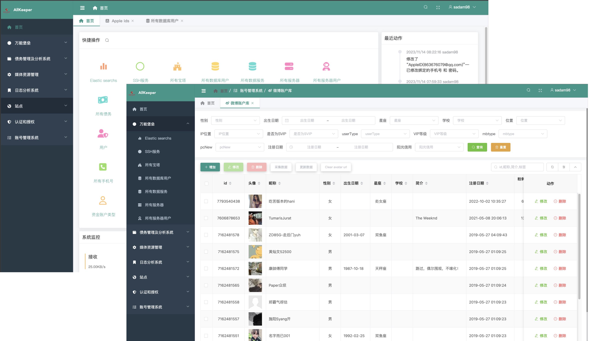
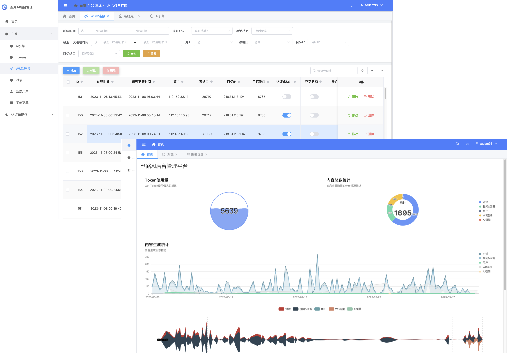
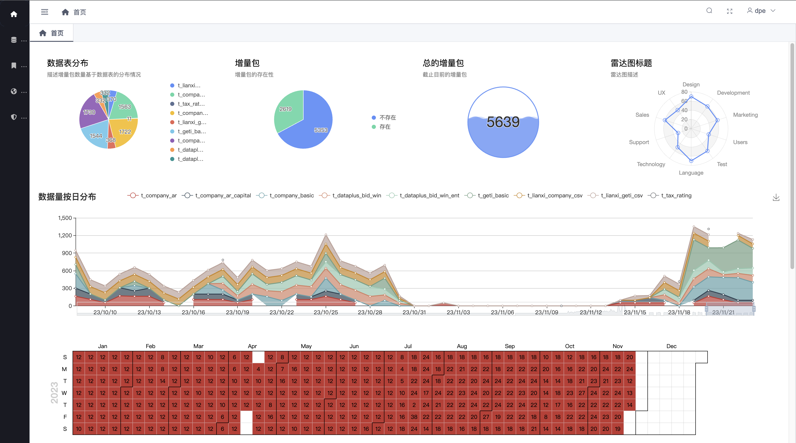

Django 新的动态Admin , 具有异步请求, 异步列表页刷新和加载, UI更加美观. 

基于vue2+ElementUI2.X来对传统的DjangoAdmin进行重写. 非常易于使用, 便于快速搭建高性能后台管理.

基于[`SimplePro:6.5.2`](https://github.com/newpanjing/simplepro) 的二开项目, 明文代码，免授权，免激活。

[](https://github.com/Haoke98/DjangoAsyncAdmin)
[](https://gitee.com/sadam98/DjangoAsyncAdmin)


[](https://forthebadge.com)


## 灵感来历
* thinkPHP
* simpleUI
* simplePro

## Demo
* [数字化世界](https://github.com/Haoke98/AllKeeper)

* [AI实验室](#)

* [过程可视化数据处理引擎](#)



## 功能
<table>
<tr><td>功能</td><td>次项</td><td>子项</td><td>状态</td></tr>
<tr><td>列表优化</td><td>前后端分离加载数据</td><td>·········</td><td>✅</td></tr>
<tr><td>可视化首页设计</td><td>·········</td><td>·········</td><td>✅</td></tr>
<tr><td>众多符合国人的主题皮肤设计</td><td>·········</td><td>·········</td><td>✅</td></tr>
<tr><td rowspan="8">丰富的组件库</td><td>几乎全部element-ui组件的集成</td><td>·········</td><td>✅</td></tr>
<tr><td rowspan="3">种类丰的富编辑器</td><td>富文本编辑器</td><td>✅</td></tr>
<tr><td>Markdown编辑器</td><td>✅</td></tr>
<tr><td>Json编辑器</td><td>✅</td></tr>
<tr>
<td rowspan="2">媒体组件</td>
<td>图片上传组件</td><td>✅</td>
</tr>
<tr><td>视频播放组件</td><td>✅</td></tr>
<tr><td rowspan="2">高级组件</td><td>地图组件</td><td>✅</td></tr>
<tr><td>密码输入组件</td><td>✅</td></tr>
<tr><td rowspan="4">支持自定义</td><td>自定义按钮</td><td>·········</td><td>✅</td></tr>
<tr><td>自定义菜单</td><td>·········</td><td>✅</td></tr>
<tr><td>自定义权限</td><td>·········</td><td>✅</td></tr>
<tr><td>自定义对话框</td><td>·········</td><td>✅</td></tr>
<tr><td>·········</td><td>·········</td><td>·········</td><td>✅</td></tr>
<tr><td>权限优化</td><td>·········</td><td>·········</td><td>✅</td></tr>
</table>

## 使用方法
### 基础
* 组件文档 [DjangoAsyncAdmin Components Docs](https://haoke98.github.io/DjangoAsyncAdmin/components.html)
* 打包及发布文档 [Package And Deploy](https://haoke98.github.io/DjangoAsyncAdmin/build.html)
* 安装配置 [临时参考](https://www.mldoo.com/docs/simplepro/guide/project_config.html)
### 进阶配置
* 全局配置 [临时参考](https://www.mldoo.com/docs/simplepro/config/global/)
* Admin配置 [临时参考](https://www.mldoo.com/docs/simplepro/config/admin/field.html)
* 主题配置 [临时参考](https://www.mldoo.com/docs/simplepro/config/theme.html)
* JS-SDK [临时参考](https://www.mldoo.com/docs/simplepro/config/jssdk.html)
* 自定义权限 [临时参考](https://www.mldoo.com/docs/simplepro/config/permissions.html)
* 可视化图标 [临时参考](https://www.mldoo.com/docs/simplepro/config/chat.html)
* 富文本插件 [临时参考](https://www.mldoo.com/docs/simplepro/config/editor.html)
### 常见问题
* 静态文件 [临时参考](https://www.mldoo.com/docs/simplepro/faq/static.html)
* 安装问题 [临时参考](https://www.mldoo.com/docs/simplepro/faq/install.html)
* 安装问题 [临时参考](https://www.mldoo.com/docs/simplepro/faq/install.html)

### 安装

#### pip安装
```shell
pip install DjangoAsyncAdmin
```

#### 源码安装

##### 1.克隆项目到本地
```shell
git clone https://github.com/Haoke98/DjangoAsyncAdmin.git
```
##### 2.生成安装包
进入到项目跟目录

```shell
python setup.py sdist bdist_wheel
```

##### 3.安装

```shell
pip install /path/to/your_project/dist/DjangoAsyncAdmin-6.5.4.tar.gz
```

注意：⚠️ 其中`/path/to/your_project`转成你的项目路径（相对路径/绝对路径）

## 目录结构说明

| 目录              | 备注       |
|-----------------|----------|
| bawa            |
| components      |
| editor          |
| group           |
| locale          |多种语言包目录，明文和二进制文件不需要处理
| management      |
| monitor         |
| static          |静态资源目录，不需要处理
| templates       |模版目录，不需要处理
| templatetags    |
| \_\_init\_\_.py |
| action.py       |
| apps.py         |
| apps.py         |
| conf.py         |
| conf.py         |
| core.so         | 转化后保存到core.py中
| decorators.py   |
| dialog.py       |
| filters.py      |
| forms.py        |
| hanlers.py      | 去掉了加载core.so文件的部分，增加了 `from core.py import *`
| middlewares.py  |
| models.py       | 基本模型文件
| urls.py         |
| utils.py        |

## 新增功能日志

<table>
<tr>
<td>版本</td><td colspan="2">说明</td>
</tr>

<tr>
<td rowspan="2">6.9.0</td>
<td colspan="2">实现了<a href="https://haoke98.github.io/DjangoAsyncAdmin/components.html#%E5%AF%86%E7%A0%81%E7%BB%84%E4%BB%B6">密码组件（PasswordInputField）</a>.</td>
</tr>
<tr>
<td colspan="2"></td>
</tr>


<tr>
<td rowspan="2">6.8.0</td>
<td colspan="2">实现了<a href="https://haoke98.github.io/DjangoAsyncAdmin/components.html#json%E7%BC%96%E8%BE%91%E5%99%A8">Json编辑器（JsonTextField）</a>.</td>
</tr>
<tr>
<td colspan="2"></td>
</tr>

<tr>
<td>6.7.0</td>
<td colspan="2">增加了基本类BaseModel和BaseModelWithShowRate，减少开发过程中反复进行一些基本字段和属性的设计, 提高设计模型的效率.</td>
</tr>


<tr>
<td>6.6.0</td>
<td colspan="2">去掉了授权和激活状态的验证机制，从比可免授权免激活，免费使用。</td>
</tr>


<tr>
<td rowspan="2">6.5.4</td>
<td colspan="2">升级并优化了后台管理登录页面中的标题和LOGO的展示.</td>
</tr>
<tr>
<td></td>
<td></td>
</tr>

<tr>
<td>6.5.3</td>
<td colspan="2">实现了列表页中的列表表头和表格底部的合计栏不动，表格bodyscroll的效果.</td>
</tr>

</table>

## 开源许可证

本仓库的代码依照 Apache-2.0 协议开源。本项目对学术研究完全开放，也可申请免费的商业使用授权。申请授权，合作和其他问题请联系 <1903243975@qq.com>。

## 引用

```
@misc{2023DjangoAsyncAdmin,
    title={DjangoAsyncAdmin},
    author={Sadam·Sadik},
    howpublished = {\url{https://github.com/Haoke98/DjangoAsyncAdmin}},
    year={2023}
}
```

## 鸣谢 & 引用

Thanks to [newpanjing](https://github.com/newpanjing/simpleui) for simpleui

Thanks to [newpanjing](https://github.com/newpanjing/simplepro) for simplepro


```include docs/components.md```